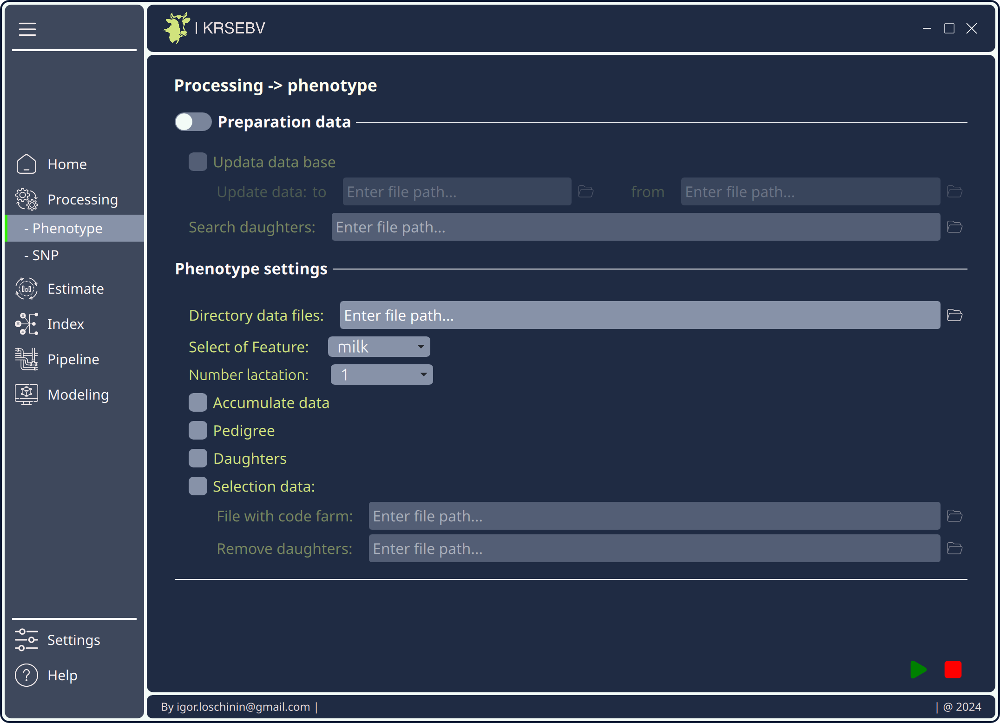

## EBVkrsDesktop
### Login form to use the application:

  

### Main page:

  

### The page where the processing and filtering of phenotic data is configured:

  

**EBVkrsDesktop** in **PySide6** and **QML**
EBVkrsDesktop - ui for an application for assessing the phenotypic (genetic) breeding value of cattle, written in PySide6 and Qml6.7
**Requirements:**
- Python 3.12.3
- PySide6
- Qml6.7

## License
This project is licensed under the MIT License - see the 
LICENSE file for details.
