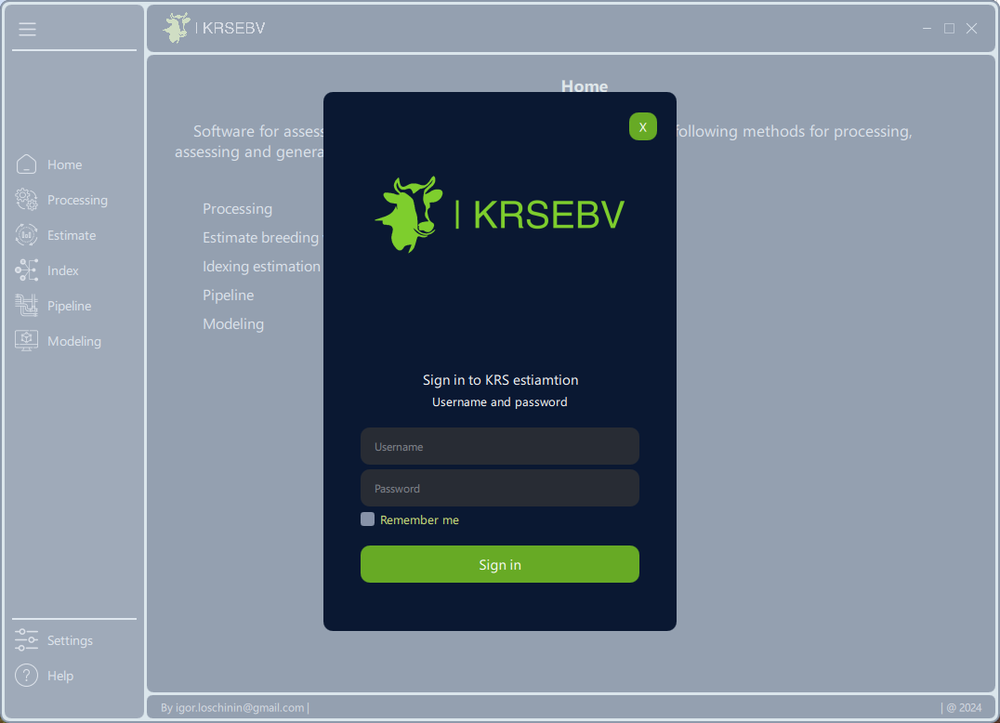
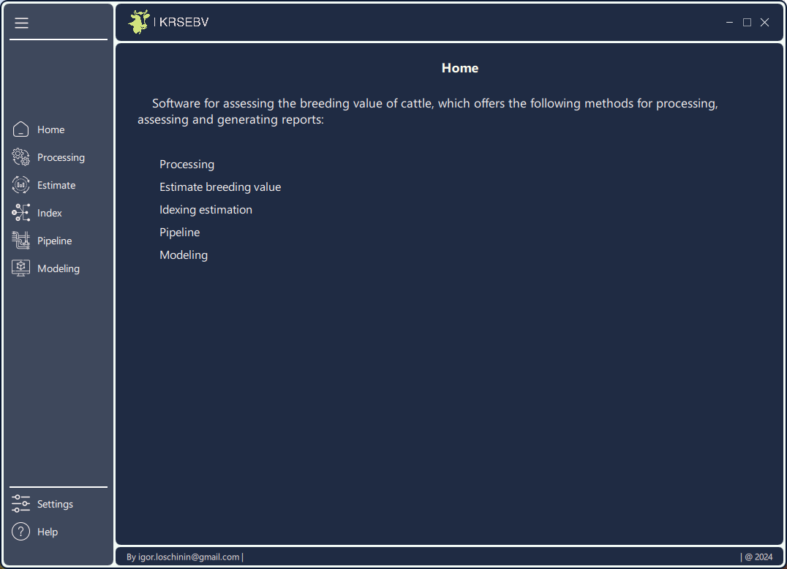
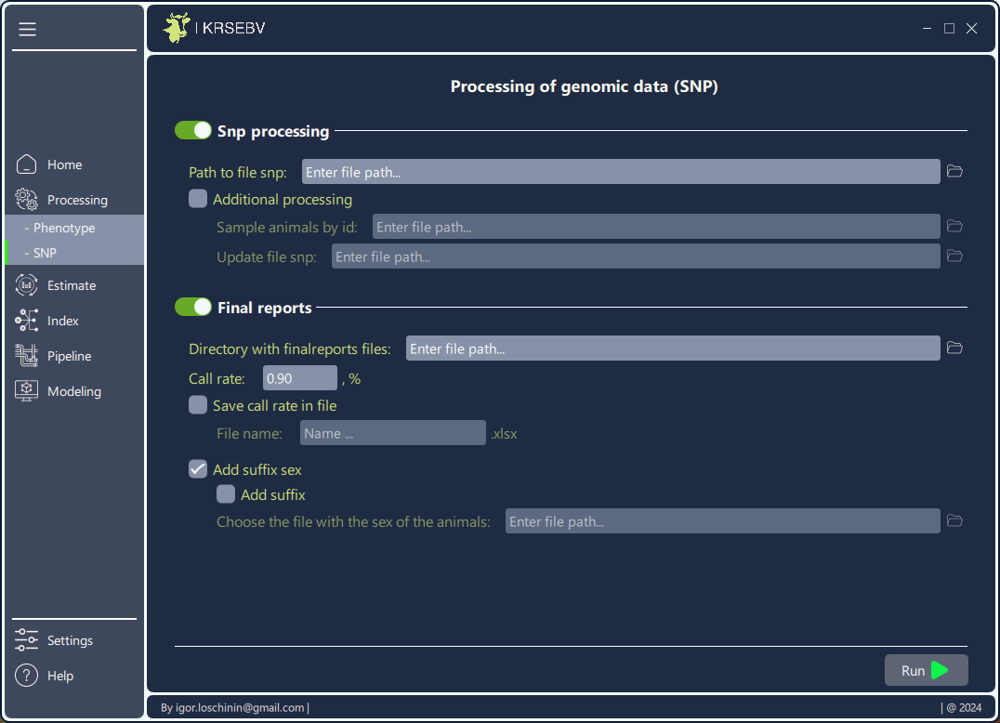

# EBVkrsDesktop

**EBVkrsDesktop** is a graphical user interface (GUI) application designed for
working with cattle data and calculating genetic value using BLUP and GBLUP 
methods. The application is built with PySide6 and QML 6.7, ensuring a modern and intuitive interface.

## Features
- **Authentication**: Secure login form for accessing the application.  
- **Data Processing**: Configuration and filtering of phenotypic data for analysis.  
- **Estimate breeding value**: Perform BLUP and GBLUP calculations to evaluate cattle breeding value.  
- **Index estimate breeding value**: Calculate breeding value using index-based methods.  
- **Report Generation**: Generate detailed reports with the results of estimate breeding value.
## Screenshots

**Login Form**:  
<p align="center">
  
</p>

**Main Page**:  
<p align="center">
  
</p>

**Data Processing Page**:  
<p align="center">
  
</p>

**SNP (Single Nucleotide Polymorphism) Page**:  
<p align="center">
  
</p>

**Estiamte breeding value Page**:  
<p align="center">
  
</p>

**Indexing estiamte breeding value Page**:  
<p align="center">
  
</p>

## Requirements

- **Python >= 3.10**  
- **PySide6**  
- **QML 6.7**

## Installation

1. **Clone the Repository**:

   ```bash
   git clone https://github.com/IgorekLoschinin/EBVkrsDesktop.git
   cd EBVkrsDesktop
   ```

2. **Create and Activate a Virtual Environment**:

   ```bash
   python -m venv venv
   source venv/bin/activate  # On Windows, use venv\Scripts\activate
   ```

3. **Install Dependencies**:

   ```bash
   pip install -r requirements.txt
   ```

## Build
To assemble the application into one executable file - .exe, you need to follow
the instructions in the Installation section, then:

```
cd scripts
build.*    # for Windows use .cmd
```

Two folders will appear in the scripts folder: build and dist:
```
scripts\
    build\
    dict\
        KRSest.exe
```

Run the application with the following command:


## Usage

1. **Run the Application**:

   ```bash
    ./KRSest.exe
   ```

2. **Authentication**: Enter your credentials on the login form to access the
application.  

3. **Data Processing**: Navigate to the data processing page to upload and 
filter phenotypic data.  

4. **Genetic Value Calculation**: Use the relevant modules to perform BLUP and
GBLUP calculations.

## License
This project is licensed under the MIT License - see the 
LICENSE file for details.
